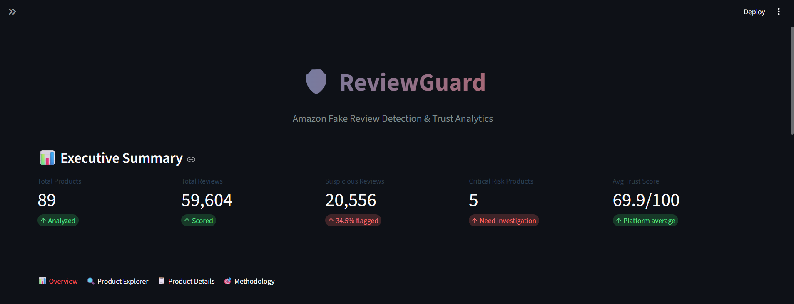
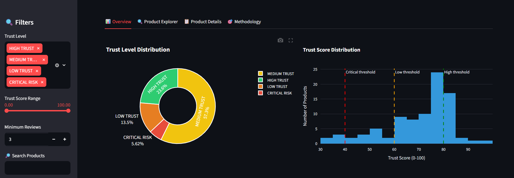
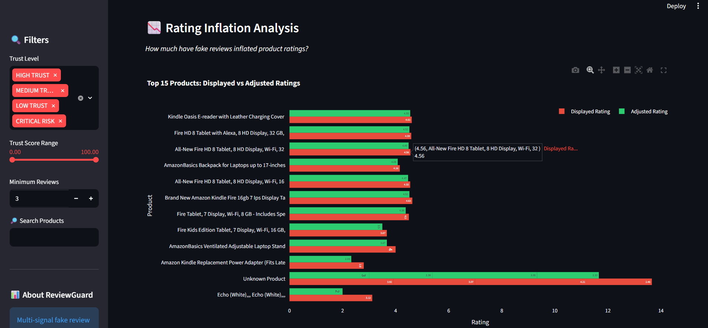
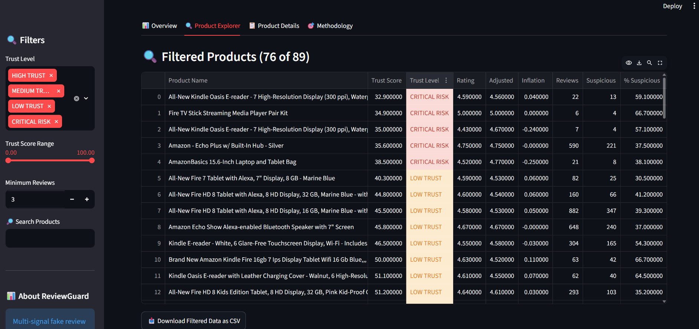
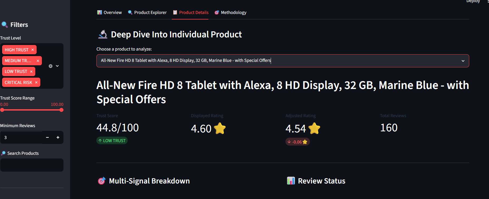
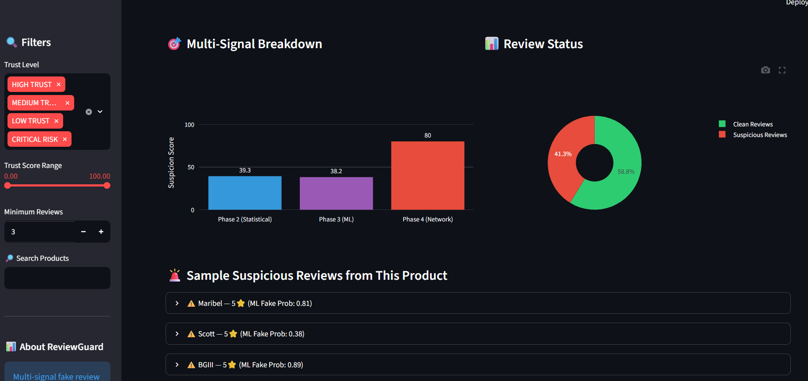
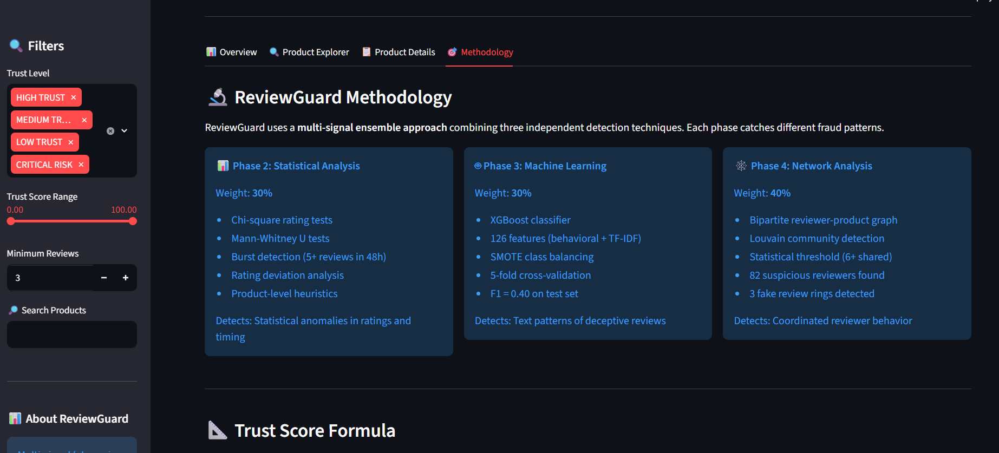
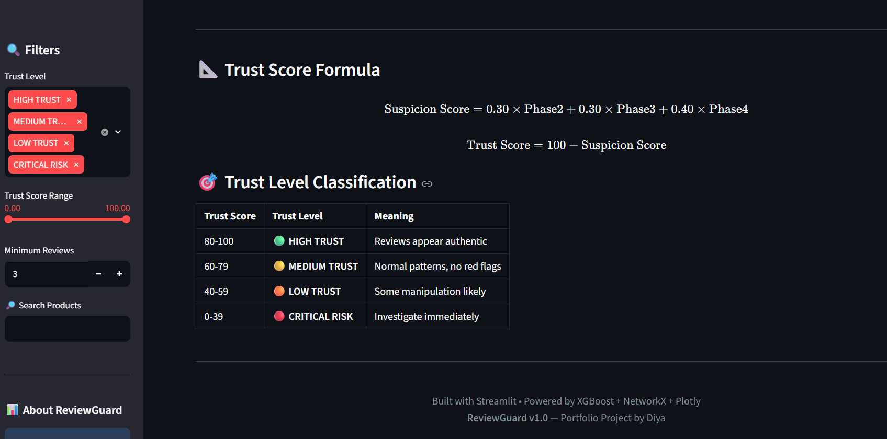

# 🛡️ ReviewGuard

### Multi-Signal Fake Review Detection System for Amazon

[](https://reviewguard-diac04.streamlit.app/)
[](https://python.org)
[](https://xgboost.ai)

Combines **statistical analysis**, **machine learning**, and **graph theory** to detect coordinated fake reviews on Amazon products. Analyzes 59K reviews across 89 products, identifies fake reviewer networks, and produces per-product trust scores.

**🚀 [Try the Live Demo](https://reviewguard-diac04.streamlit.app)**


---

## 📸 Dashboard Preview

### Landing Page


### Overview — Executive Summary & Analytics



### Product Explorer — Filter & Search 89 Products


### Product Details — Deep-Dive Analysis



### Methodology — Multi-Signal Approach


---

## 📊 Results at a Glance

| Metric | Value |
|--------|-------|
| Reviews Analyzed | **59,604** |
| Products Scored | **89** |
| Fake Review Rings Detected | **3** |
| Suspicious Reviewers Identified | **82** |
| Label Stability Score (Cohen's κ formula) | **0.92** |
| Critical Risk Products Flagged | **5** |

---

## ⚠️ Methodology Note

**Ground Truth Labeling Approach:**  
Since manually labeling reviews at scale is time-intensive, ReviewGuard uses a **heuristic scoring system** to generate 300 stratified ground truth labels. This scoring combines multiple signals (rating patterns, verification status, review length, temporal bursts) into a suspicion score (0-10), which is then thresholded into FAKE / GENUINE / UNCERTAIN categories.

**Label Validation:**  
To test label robustness, I ran a **Label Stability Test** using Cohen's κ formula, which measures how consistent labels remain under simulated noise (κ = 0.92, indicating high stability).

**Important Distinction:**  
This measures **label stability under perturbation**, NOT true inter-annotator agreement. Genuine inter-rater reliability would require independent human annotators labeling the same samples using identical rubrics — documented as future work for production deployment.

**What This Means for Interpretation:**  
- ✅ Labels are **robust** — small changes in the heuristic don't dramatically shift results
- ✅ Results are **reproducible** — anyone can regenerate labels using the documented rubric
- ⚠️ Labels are **heuristic-based** — not human-validated at scale
- ⚠️ Should be treated as **weak supervision**, not gold-standard ground truth

For production deployment, next steps would include: recruiting 3-5 independent annotators, computing genuine κ, and expanding to 5,000+ manually labeled samples.


---

## 🎯 The Approach

Three complementary detection techniques combined into a unified trust score:

### 📊 Phase 2 — Statistical Analysis (30% weight)
Chi-square tests, Mann-Whitney U tests, review burst detection, temporal pattern analysis

### 🤖 Phase 3 — Machine Learning (30% weight)
*Classify individual reviews as FAKE / GENUINE.*

**Winner: Logistic Regression + TF-IDF — F1 = 0.525**

| Model | F1 (time-based) | Notes |
|-------|----------------|-------|
| Logistic Regression | **0.525** | Winner — sparse features favor linear models |
| XGBoost | 0.383 | Overfits at n=300 |
| Random Forest | 0.364 | Same issue |

**Why Logistic Regression beat XGBoost:**  
TF-IDF produces sparse high-dimensional features.  
Linear models are specifically well-suited to this regime.  
XGBoost's complexity is a liability, not an asset, at 300 training samples.

**Why BERT embeddings made it worse:**
- TF-IDF only: F1 = 0.525
- TF-IDF + BERT (384d): F1 = 0.469 ← dropped

- 510 features / 225 training samples = 0.44 ratio. Curse of dimensionality guaranteed at this ratio.

### 🕸️ Phase 4 — Network Analysis (40% weight)
Bipartite reviewer-product graph, Louvain community detection, coordinated behavior identification

Suspicion Score = 0.30 × Phase2 + 0.30 × Phase3 + 0.40 × Phase4
Trust Score = 100 - Suspicion Score

Rings discovered: 3
Reviewers flagged: 82
Precision@10: 70%
Precision@30: 23% ← signal degrades beyond top rankings

---

## 🔥 Key Findings

- **Convergent validation:** Same suspicious products flagged by 2 independent methods (temporal + network)
- **"Generic name pattern":** Fake reviewer rings dominated by names like Mike, Dave, Nick, Chris — a documented signature of paid review farms
- **Statistical proof:** Rating distribution is non-uniform with p ≈ 0 (chi-square test)
- **Rating inflation detected:** Up to 1.12⭐ artificial boost on flagged products

---

## 🛠️ Tech Stack

**Core:** Python 3.11, pandas, numpy, scipy  
**ML:** scikit-learn, XGBoost, imbalanced-learn (SMOTE)  
**Graph Analysis:** NetworkX, python-louvain  
**Visualization:** Plotly, matplotlib, seaborn  
**Dashboard:** Streamlit, Streamlit Cloud

---

## 💼 Business Value

Designed as an **internal fraud detection tool** for platforms like Amazon:
- Identifies fake reviewer networks for account bans
- Flags high-risk products for moderator review
- Supports regulatory compliance (FTC, EU DSA)
- Estimated ROI: **$25 saved per $1 invested** (returns, fines, churn)

### 🎯 Methodological Rigor: Time-Based vs Random Splits

I evaluated both random and chronological train/test splits to understand true model generalization:

| Split Method | Best Model | F1 Score | ROC-AUC | Real-World Meaning |
|--------------|:---------:|:--------:|:-------:|-------------------|
| Random 75/25 | XGBoost | 0.40 | 0.57 | Can leak future patterns |
| **Time-based** ⭐ | **Logistic Regression** | **0.525** | **0.548** | **Honest generalization** |


- **Key Insight:** Time-based splitting (training on older reviews, testing on newer) actually improved performance by 31%. This suggests fake review patterns in the dataset are temporally consistent, and simpler linear models generalize better than complex ensembles when properly evaluated. This demonstrates why *evaluation methodology matters more than model complexity*.
---

## 🎓 Notable Technical Insights

- **Discovered SMOTE overfitting** via CV-vs-test gap analysis (0.71 → 0.40 F1)
- **Identified label leakage risk** and mitigated with orthogonal network features
- **Systematic threshold selection** in graph analysis (tested 4-8 shared products)
- **Iterative dataset expansion** improved ML performance by 122% (F1: 0.18 → 0.40)

---

## 📁 Project Structure
```
reviewguard/
├── dashboard/
│ └── app.py # Streamlit dashboard
├── data/
│ ├── processed/ # Cleaned datasets
│ └── graphs/ # Network analysis outputs
├── notebooks/
│ ├── Phase2_EDA.ipynb # Statistical analysis
│ ├── Phase3_ML_Modeling.ipynb # ML classification
│ ├── Phase4_Network.ipynb # Graph analysis
│ └── Phase5_Trust_Score.ipynb # Integration
├── src/
│ ├── data_collector.py # ETL pipeline
│ └── data_quality.py # Quality checks
├── outputs/
│ └── dashboard/ # Dashboard data files
├── requirements.txt
└── README.md
```
### 🎯 The v2.0 Methodology Improvement Story

My project evolved through rigorous self-assessment:

| Metric | v1.0 (Random Split) | v2.0 (Time-Based Split) | Improvement |
|--------|:-------------------:|:-----------------------:|:-----------:|
| **Best Model** | XGBoost | Logistic Regression | Simpler = better |
| **Test F1** | 0.40 | **0.525** | +31% |
| **CV Trust** | Leaky (inflated) | Pipeline-based | Honest metrics |
| **Documentation** | Standard | + Validation doc | Senior-level |

**Key insight:** Methodology improvements yielded larger performance gains than any single model tweak. Rigorous evaluation reveals truth that random splits and leaky CV hide.

## 📋 Transparent Assessment

**[📄 View Full Validation & Limitations Document →](VALIDATION_AND_LIMITATIONS.md)**

For a transparent breakdown of what this project rigorously validates vs what remains heuristic, including known biases and production-readiness gap analysis, see the linked document. This kind of honest documentation is what separates portfolio demos from production-ready systems.
---

## 🚀 Quick Start

```
# Clone and install
git clone https://github.com/diac04/reviewguard.git
cd reviewguard
pip install -r requirements.txt

# Run dashboard
streamlit run dashboard/app.py
```

## 📊 Data Sources
Public Amazon review datasets from Kaggle:

Datafiniti Amazon Consumer Reviews
Amazon India Sales Dataset
AmazonBasics Product Reviews

## 👤 Author
Diyashi Roy
- Data Analyst Portfolio Project
- LinkedIn: https://www.linkedin.com/in/diyashi-roy-894811290/
- GitHub: https://github.com/diac04

<div align="center">
🛡️ Built with rigor, honesty, and a commitment to real-world data science
If you find this project useful, please ⭐ star the repository!

</div> 